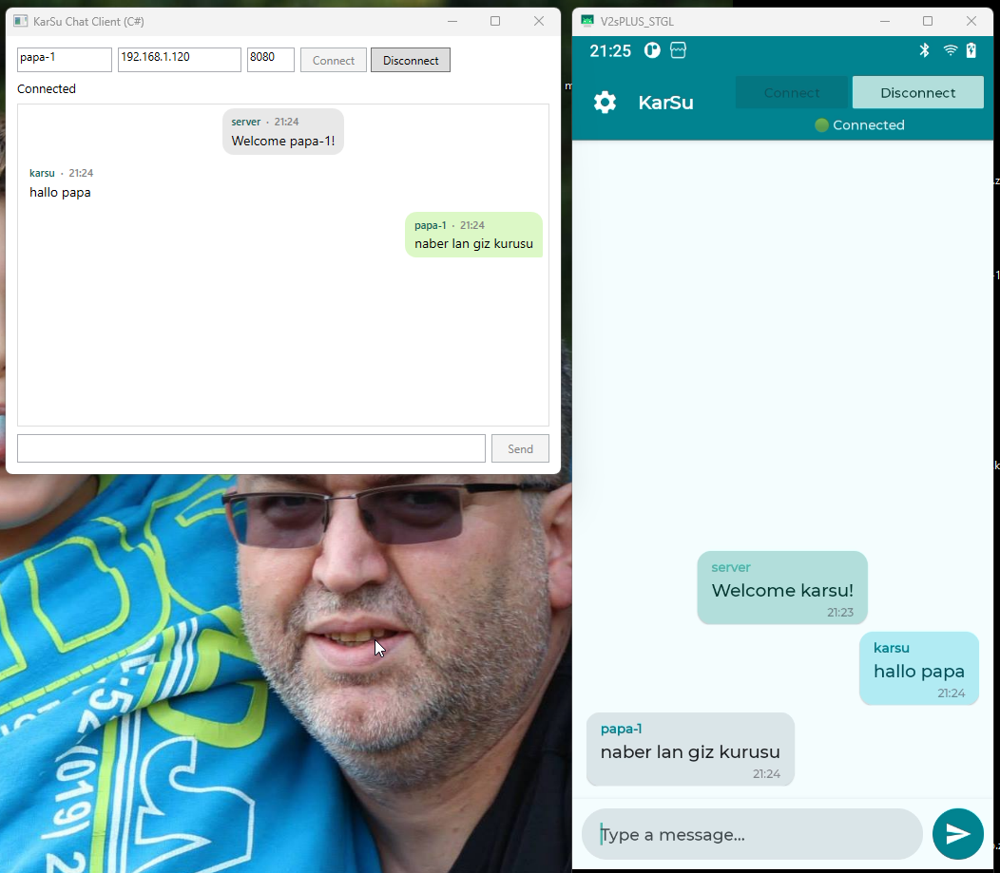
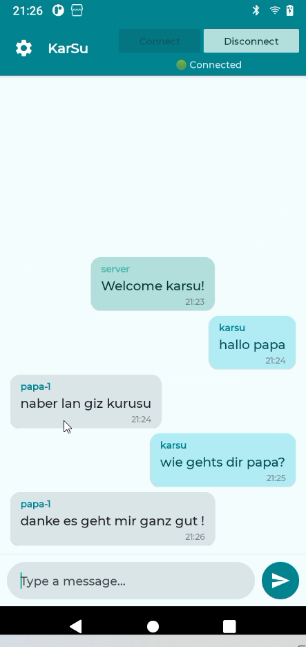
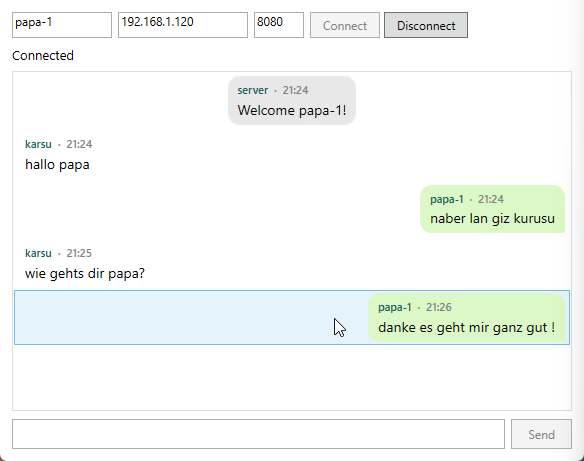

# KarSu Chat — Real-Time Multi-Platform Messaging

> [Turkce README / Turkish README](README_TR.md)

A real-time WebSocket chat application with an **embedded Ktor server**, an **Android client**, and a **C# WPF desktop client** — all communicating over JSON via WebSocket.

<p align="center">
  
</p>

<p align="center">
  
  
</p>

## Architecture

```
┌─────────────────────────────────────────────────────────┐
│                     KTOR SERVER                         │
│              ws://host:8080/chat/{clientId}              │
│                                                         │
│   Routing.kt ──▶ ConnectionManager                      │
│   (WebSocket)     - addConnection(id, session)          │
│                   - removeConnection(id)                │
│                   - broadcast(msg, excludeId)           │
│                                                         │
│   GET /health     → Health check                        │
│   GET /clients    → Connected client list               │
└────────────┬────────────────────┬───────────────────────┘
             │                    │
       WebSocket             WebSocket
             │                    │
┌────────────▼──────────┐ ┌──────▼──────────────────────┐
│   ANDROID CLIENT      │ │   C# WPF CLIENT             │
│   (Kotlin · MVVM)     │ │   (.NET 8 · MVVM)           │
│                       │ │                              │
│  View (Activity+XML)  │ │  View (MainWindow.xaml)      │
│    ↕ StateFlow        │ │    ↕ Data Binding            │
│  ViewModel            │ │  ViewModel                   │
│    ↕                  │ │    ↕                         │
│  Repository           │ │  WebSocketService            │
│    ↕                  │ │  (ClientWebSocket)           │
│  WebSocketDataSource  │ │                              │
│  (Ktor Client)        │ │  SettingsService (JSON)      │
└───────────────────────┘ └─────────────────────────────┘
```

## Tech Stack

### Ktor Server (Embedded)
| Technology | Version | Purpose |
|---|---|---|
| Kotlin | 2.3.10 | Language |
| Ktor Server | 3.4.0 | WebSocket server (Netty engine) |
| kotlinx.serialization | 1.10.0 | JSON serialization |
| Koin | 4.0.4 | Dependency injection |
| Logback | 1.5.30 | Logging |

### Android Client
| Technology | Version | Purpose |
|---|---|---|
| Kotlin | 2.3.10 | Language |
| Ktor Client | 3.4.0 | WebSocket client (OkHttp engine) |
| Material 3 | 1.13.0 | UI components & theming |
| Lifecycle | 2.9.1 | ViewModel + StateFlow |
| Koin | 4.0.4 | Dependency injection |
| Coroutines | 1.10.1 | Async operations |
| ViewBinding | — | Type-safe view access |

### C# WPF Client
| Technology | Version | Purpose |
|---|---|---|
| .NET | 8.0 | Runtime |
| WPF | — | Desktop UI framework |
| System.Text.Json | — | JSON serialization |
| ClientWebSocket | — | Native WebSocket client |

## Project Structure

```
KtorWebSocketMVVM/
├── app/                          # Android client module
│   └── src/main/java/.../
│       ├── di/                   # Koin DI module
│       ├── data/
│       │   ├── model/            # ChatMessage, ConnectionState, ErrorType
│       │   ├── remote/           # WebSocketDataSource (Ktor Client)
│       │   └── repository/       # ChatRepository
│       └── ui/chat/              # ChatActivity, ChatViewModel, ChatAdapter
│
├── ktor-server/                  # Embedded Ktor server module
│   └── src/main/kotlin/com/karsu/
│       ├── di/                   # Koin server module
│       ├── model/                # ChatMessage
│       ├── plugins/              # Routing, Sockets, Serialization
│       └── session/              # ConnectionManager
│
├── csharp-client/                # WPF desktop client
│   ├── Models/                   # ChatMessage
│   ├── ViewModels/               # ChatViewModel, BaseViewModel, RelayCommand
│   ├── Views/                    # MainWindow.xaml
│   └── Services/                 # WebSocketService, SettingsService, Logger
│
└── screenshots/
```

## How It Works

1. **Server starts** embedded inside the Android app on port `8080` (also runnable standalone)
2. **Clients connect** via WebSocket to `ws://<host>:8080/chat/<clientId>`
3. Server sends a **welcome message** to the connecting client
4. When a client sends a message, the server **broadcasts** it to all other connected clients
5. Messages are JSON-encoded with `sender`, `content`, and `timestamp` fields

### Message Format
```json
{
  "sender": "karsu",
  "content": "Hello!",
  "timestamp": 1771100166330
}
```

### Message Flow
```
C# Client: types "Hello!" → Send
  → WebSocket frame → Ktor Server
  → Server broadcasts → Android Client
  → Android displays bubble: "papa-1: Hello!"

Android: types "Hi!" → Send
  → WebSocket frame → Ktor Server
  → Server broadcasts → C# Client
  → C# displays bubble: "karsu: Hi!"
```

## Features

- **WhatsApp-style chat bubbles** — own messages right-aligned, others left-aligned, server messages centered
- **Dark / Light theme** toggle with MaterialSwitch (Android)
- **Persistent settings** — host, port, username saved across sessions (both clients)
- **Custom font** — Montserrat Medium (Android)
- **Enter key** to send messages (both clients)
- **Connection state management** — Connecting, Connected, Disconnected, Error states
- **File-based logging** (C# client)

## Getting Started

### Option 1: Server Embedded in Android
1. Open the project in Android Studio
2. Run the `app` module — the Ktor server starts automatically on port `8080`
3. Run the C# client: `cd csharp-client && dotnet run`
4. Enter the Android device's IP address in the C# client and connect

### Option 2: Standalone Server
```bash
cd ktor-server
./gradlew run
# Server runs at ws://localhost:8080/chat/{clientId}
```

### Android Client
- **Emulator** → Host: `10.0.2.2`
- **Real device on same network** → Host: your PC's IP address
- Tap the settings icon to configure host, port, and username

### C# WPF Client
```bash
cd csharp-client
dotnet run
```
- Enter host IP, port, and username in the top bar
- Settings are persisted automatically in `settings.json`

## MVVM Layers

### Android (Kotlin)
| Layer | File | Responsibility |
|---|---|---|
| **Model** | `ChatMessage.kt`, `ConnectionState.kt` | Data classes |
| **View** | `ChatActivity.kt` + XML layouts | UI rendering, observing StateFlow |
| **ViewModel** | `ChatViewModel.kt` | UI state, user actions |
| **Repository** | `ChatRepository.kt` | Abstracts data source |
| **DataSource** | `WebSocketDataSource.kt` | Ktor Client WebSocket I/O |

### C# WPF (.NET 8)
| Layer | File | Responsibility |
|---|---|---|
| **Model** | `ChatMessage.cs` | Data class with JSON attributes |
| **View** | `MainWindow.xaml` | WPF UI with data binding |
| **ViewModel** | `ChatViewModel.cs` | INotifyPropertyChanged, RelayCommand |
| **Service** | `WebSocketService.cs` | ClientWebSocket management |
| **Service** | `SettingsService.cs` | JSON file persistence |

## License

This project is licensed under the [MIT License](LICENSE).
